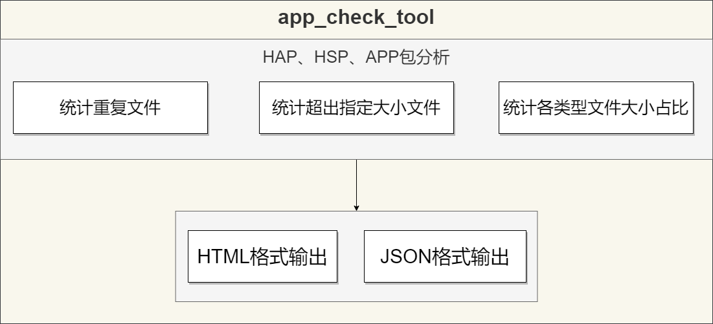

# 扫描工具使用说明

## 简介

扫描工具是一个针对鸿蒙应用安装包的分析检测工具，根据不同的参数设定，可以扫描指定路径的hap、hsp、app包的内容并输出检测结果报告，为开发者提供一个分析排查问题的数据支撑。目前扫描工具支持以下几种分析统计：扫描重复的文件、扫描超出指定大小的文件、统计分析各类型文件的总大小和占比。扫描工具默认以JSON和HTML两种文件格式输出扫描结果。

### 扫描工具系统架构图



## 1.输入命令参数定义及示例参考

### 1.1 命令参数定义及规范

| 指令               | 是否必选项 | 选项           | 描述                                       | 备注       |
|-----------------|-------|--------------|------------------------------------------|------------|
| --input          | 是     | NA           | 指定传入的hap、hsp、app包文件路径                    | NA         |
| --out-path       | 是     | NA           | 指定结果输出文件夹目录                              | NA         |
| --stat-duplicate | 否     | true 或 false | 扫描重复文件 <br>true-启用，false-不启用<br>其它输入为false  | NA         |
| --stat-file-size | 否     | NA           | 扫描超过设定大小的文件，单位KB <br>范围为 0-4294967295 KB | int/KB     |
| --stat-suffix    | 否     | true 或 false | 统计各类型文件大小及占比 <br>true-启用，false-不启用<br>其它输入为false     | NA         |


### 1.2 参考示例

- 示例1：扫描重复文件

```
java -jar app_check_tool.jar --input <option> --out-path <option> --stat-duplicate true
```

- 示例2：扫描超出指定大小的文件


```
java -jar app_check_tool.jar --input <option> --out-path <option> --stat-file-size [option]
```

- 示例3：统计各类型文件大小及占比


```
java -jar app_check_tool.jar --input <option> --out-path <option> --stat-suffix true
```

- 示例4：多个统计参数组合


```
java -jar app_check_tool.jar --input <option> --out-path <option> --stat-duplicate [option] --stat-file-size [option] --stat-suffix [option]
```

## 2. 输出结果数据字段定义

扫描工具以JSON和HTML两种格式文件输出扫描结果。根据输入参数不同，扫描工具可以执行不同类型的分析任务，并以列表形式组合输出不同类型任务的统计结果。
- <a href="#21-扫描结果任务字段信息">2.1小节：</a>所有任务类型共有的数据字段定义，result字段根据不同的任务类型对应不同的数据结构。
- <a href="#22-重复文件统计结果字段信息">2.2小节：</a>任务类型为1，扫描重复文件，结果中result字段定义。
- <a href="#23-超出指定大小的文件统计结果字段信息">2.3小节：</a>任务类型为2，扫描超出指定大小文件，结果中result字段定义。
- <a href="#24-各类型文件大小占比统计结果字段信息">2.4小节：</a>任务类型为3，统计各类型文件大小及占比，结果中result字段定义。
  - <a href="#241-同类型文件的对应路径和大小字段信息">2.4.1小节：</a>任务类型为3时，扫描结果result中files字段定义。

### 2.1 扫描结果任务字段信息

| 字段            | 类型                | 描述                                                              | 备注 |
| ----------------|--------------------|-----------------------------------------------------------------| ---- |
| taskType        | int                | 任务类型 <br> 1 - 扫描重复文件  <br> 2 - 扫描超出指定大小的文件 <br> 3 - 统计各类型文件大小占比 | NA  |
| taskDesc        | String             | 任务的详细描述                                                         | NA   |
| param           | String             | 扫描程序传入参数                                                        | NA   |
| startTime       | String             | 任务开始时间                                                          | NA   |
| stopTime        | String             | 任务结束时间                                                          | NA   |
| pathList        | Vector\<String>    | 多个hap、hsp包的路径<br>仅在统计各类型文件占比<br>功能开启时且有多个hap、hsp包时展示            | NA   |
| result          |  NA                | 任务扫描结果的详细信息（列表）                                                 | NA   |

### 2.2 重复文件统计结果字段信息

| 字段            | 类型               | 描述                                    | 备注 |
| ----------------| ------------------ |----------------------------------------| ---- |
| md5             | String             | 相同文件的MD5值                         | NA   |
| size            | int                | 相同文件的大小                          | Byte |
| files           | Vector\<String>    | 相同文件名的对应路径                     | NA   |

### 2.3 超出指定大小的文件统计结果字段信息

| 字段            | 类型               | 描述                                     | 备注 |
| --------------- | ------------------ |----------------------------------------| ---- |
| file            | String             | 扫描的大文件的对应路径                   | NA   |
| size            | int               | 扫描的大文件的对应大小                    | Byte |

### 2.4 各类型文件大小占比统计结果字段信息

| 字段            | 类型               | 描述                                     | 备注 |
| ----------------| ------------------ |----------------------------------------| ---- |
| suffix          | String             | 同类型文件后缀名                        | NA   |
| totalSize       | int                | 扫描的同类型<br>文件的总大小             | Byte |
| files           | NA                 | 扫描的同类型<br>文件的对应路径和大小      | NA   |

#### 2.4.1 同类型文件的对应路径和大小字段信息
| 字段            | 类型                | 描述                                     | 备注 |
| ----------------| ------------------ |----------------------------------------| ---- |
| file           | String    | 文件路径                                          | NA   |
| size           | int       | 文件的大小                                         | Byte   |
| compress       | bool      | true 表示so类型文件是压缩文件<br>false 表示so类型文件不是压缩文件  | NA   |


## 3.扫描结果输出示例：JSON格式

### 3.1 统计重复文件示例

该示例分为两部分，命令示例和统计结果。详情如下：

#### 命令示例：
```
java -jar app_check_tool.jar --input ./test.app --out-path ./test --stat-duplicate true
```

#### 统计结果：
```
[{
	"param":"--stat-duplicate",
	"result":[{
		"files":[
			"/home/admin/1116Test/duplicate/application-entry-default.hap/libs/armeabi-v7a/example.so",
			"/home/admin/1116Test/duplicate/entry-default.hap/libs/armeabi-v7a/example.so"
		],
		"md5":"975c41f5727b416b1ffefa5bb0f073b",
		"size":1108880
	}],
	"startTime":"2023-11-17 14:48:01:265",
    "stopTime":"2023-11-17 14:48:01:434",
	"taskDesc":"find the duplicated files",
	"taskType":1
}]
```

### 3.2 统计超出指定大小的文件示例

该示例分为两部分，命令示例和统计结果。详情如下：

#### 命令示例：
```
java -jar app_check_tool.jar --input ./test.app --out-path ./test --stat-file-size 4
```

#### 统计结果：
```
[{
	"param":"--stat-file-size 4",
	"result":[{
			"file":"/home/admin/1116Test/fileSize/application-entry-default.hap/libs/x86_64/example.so",
			"size":1292840
	}],
	"startTime":"2023-11-17 14:48:01:458",
	"stopTime":"2023-11-17 14:48:01:491",
	"taskDesc":"find files whose size exceed the limit size",
	"taskType":2
}]
```

### 3.3 统计各类型文件大小占比示例

该示例分为两部分，命令示例和统计结果。详情如下：

#### 命令示例：
```
java -jar app_check_tool.jar --input ./test.app --out-path ./test --stat-suffix true
```

#### 统计结果：
```
[{
	"param":"--stat-suffix",
	"pathList":[
		"/home/admin/1116Test/temporary/application-entry-default.hap",
		"/home/admin/1116Test/temporary/entry-default.hap"
	],
	"result":[{
		"files":[{
			"compress":"false",
			"file":"/home/admin/1116Test/suffix/application-entry-default.hap/libs/x86_64/example.so",
			"size":1292840
		}],
		"suffix":"so",
		"totalSize":1292840
	},
	{
		"files":[{
			"file":"/home/admin/1116Test/suffix/application-entry-default.hap/ets/modules.abc",
			"size":76304
		},
		{
			"file":"/home/admin/1116Test/suffix/entry-default.hap/ets/modules.abc",
			"size":8548
		}],
		"suffix":"abc",
		"totalSize":84852
	}],
	"startTime":"2023-11-17 14:48:01:497",
	"stopTime":"2023-11-17 14:48:01:537",
	"taskDesc":"show files group by file type[.suffix]",
	"taskType":3
}]
```

## 4.扫描结果输出示例：HTML格式

### 4.1 统计重复文件示例

该示例分为两部分，命令示例和统计结果。详情如下：

#### 命令示例：
```
java -jar app_check_tool.jar --input ./test.app --out-path ./test --stat-duplicate true
```

#### 统计结果：
<div id="box">
        <table>
            <tr>
                <td>taskType</td>
                <td>1</td>
            </tr>
            <tr>
                <td>taskDesc</td>
                <td>find the duplicated files</td>
            </tr>
            <tr>
                <td>param</td>
                <td>--stat-duplicate</td>
            </tr>
            <tr>
                <td>startTime</td>
                <td>2023-11-17 14:48:01:265</td>
            </tr>
            <tr>
                <td>stopTime</td>
                <td>2023-11-17 14:48:01:434</td>
            </tr>
            <tr>
                <td>result</td>
                <td>
                    <ul>
                        <li>
                            <table>
                                <tr>
                                    <td>md5</td>
                                    <td>975c41f5727b416b1ffefa5bb0f073b</td>
                                </tr>
                                <tr>
                                    <td>size</td>
                                    <td>1108880</td>
                                </tr>
                                <tr>
                                    <td>files</td>
                                    <td>
                                        <ul>
                                            <li>
                                                /home/admin/1116Test/duplicate/entry-default.hap/libs/example.so
                                            </li>
                                            <li>
                                                /home/admin/1116Test/duplicate/application-entry-default.hap/libs/example.so
                                            </li>
                                        </ul>
                                    </td>
                                </tr>
                            </table>
                        </li>
                    </ul>
                </td>
            </tr>
        </table>
</div>

### 4.2 统计超出指定大小的文件示例

该示例分为两部分，命令示例和统计结果。详情如下：

#### 命令示例：
```
java -jar app_check_tool.jar --input ./test.app --out-path ./test --stat-file-size 4
```

#### 统计结果：
<div id="box">
        <table>
            <tr >
                <td>taskType</td>
                <td>2</td>
            </tr>
            <tr>
                <td>taskDesc</td>
                <td>find files whose size exceed the limit size</td>
            </tr>
            <tr>
                <td>param</td>
                <td>--stat-file-size 4</td>
            </tr>
            <tr>
                <td>startTime</td>
                <td>2023-11-17 14:48:01:458</td>
            </tr>
            <tr>
                <td>stopTime</td>
                <td>2023-11-17 14:48:01:491</td>
            </tr>
            <tr>
                <td>result</td>
                <td>
                    <table>
                        <tr>
                            <td>file</td>
                            <td>size</td>
                        </tr>
                        <tr>
                            <td>
                                /home/admin/1116Test/fileSize/application-entry-default.hap/libs/x86_64/example.so
                            </td>
                            <td>1292840</td>
                        </tr>
                    </table>
                </td>
            </tr>
        </table>
</div>

### 4.3 统计各类型文件大小占比示例

该示例分为两部分，命令示例和统计结果。详情如下：

#### 命令示例：
```
java -jar app_check_tool.jar --input ./test.app --out-path ./test --stat-suffix true
```

#### 统计结果：
<div id="box">
    <body>
        <table>
            <tr>
                <td>taskType</td>
                <td>3</td>
            </tr>
            <tr>
                <td>taskDesc</td>
                <td>show files group by file type[.suffix]</td>
            </tr>
            <tr>
                <td>param</td>
                <td>--stat-suffix</td>
            </tr>
            <tr>
                <td>startTime</td>
                <td>2023-11-17 14:48:01:497</td>
            </tr>
            <tr>
                <td>stopTime</td>
                <td>2023-11-17 14:48:01:537</td>
            </tr>
			<tr>
				<td>pathList</td>
				<td>
					/home/admin/1116Test/temporary/application-entry-default.hap<br>/home/admin/1116Test/temporary/entry-default.hap<br>
				</td>
			</tr>
            <tr>
                <td>result</td>
                <td>
                    <ul>
                        <li>
                            <table>
                                <tr>
                                    <td>suffix</td>
                                    <td>so</td>
                                </tr>
                                <tr>
                                    <td>totalSize</td>
                                    <td>1292840</td>
                                </tr>
                                <tr>
                                    <td>files</td>
                                    <td>
                                        compress:false<br>size:1292840<br>file:/home/admin/1116Test/suffix/application-entry-default.hap/libs/x86_64/example.so
                                    </td>
                                </tr>
                            </table>
                        </li>
						<li>
                            <table>
                                <tr>
                                    <td>suffix</td>
                                    <td>abc</td>
                                </tr>
                                <tr>
                                    <td>totalSize</td>
                                    <td>84852</td>
                                </tr>
                                <tr>
                                    <td>files</td>
                                    <td>
                                        size:8548<br>file:/home/admin/1116Test/suffix/entry-default.hap/ets/modules.abc<br>size:76304<br>file:/home/admin/1116Test/suffix/application-entry-default.hap/ets/modules.abc<br>
                                    </td>
                                </tr>
                            </table>
                        </li>
                    </ul>
                </td>
            </tr>
        </table>
	</body>
</div>


## 5.优化建议
- 对于扫描出的重复文件，开发者可以去除重复从而减小应用包大小。若同一app的多个hap中存在重复文件，
可以考虑使用HSP动态共享库的方式将重复资源提取出来，从而减小app的总大小。
- 对于扫描出的比较大的文件，可根据不同的文件类型做适当优化处理。
   - png/jpeg文件，可以使用特定工具缩减大小，同时不损失画质。
   - so文件，DevEco Studio支持对so库打包时压缩。